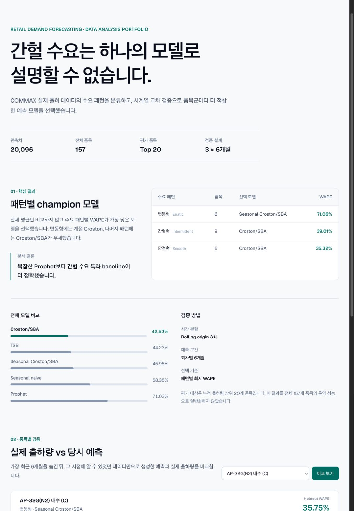

# Demand Signal

> 수요 패턴을 분류하고, 시계열 교차 검증으로 품목별 예측 모델을 선택하는 리테일 수요 예측 분석 포트폴리오

## Live Demo

[**Demand Signal 대시보드 열기**](https://demand-signal-sepia.vercel.app) · [GitHub Repository](https://github.com/Samuel-0930/AI-Driven-Retail-Demand-Forecasting-Platform)

공개 데모에서는 품목을 선택해 **실제 출하량 vs 당시 예측**, 월별 절대 오차, 수요 패턴별 champion 모델을 확인할 수 있습니다. 원본 CSV는 공개하지 않고, 분석에 필요한 상위 20개 품목의 최소 공개 데이터셋만 제공합니다.

## 한눈에 보기

**간헐 수요는 하나의 모델로 설명할 수 없다**는 질문에서 출발했습니다. COMMAX 실제 월별 출하 데이터를 수요 패턴별로 나누고, 단순 기준선부터 Prophet까지 동일한 rolling-origin 검증으로 비교했습니다. 결과적으로 복잡한 모델 하나를 전체에 적용하기보다, 품목군의 수요 특성에 맞춰 모델을 선택하는 방식이 더 설득력 있었습니다.

| 분석 범위 | 검증 설계 | 평가 대상 | 핵심 산출물 |
| --- | --- | --- | --- |
| 20,096개 월별 관측치 · 157개 품목 | 3회 rolling origin · 회차별 6개월 | 누적 출하량 상위 20개 품목 | 패턴별 champion 모델 · 실제 vs 당시 예측 |

## 핵심 결과

패턴별로 WAPE가 가장 낮은 모델을 champion으로 선택했습니다.

| 수요 패턴 | 품목 수 | 선택 모델 | WAPE |
| --- | ---: | --- | ---: |
| Erratic (변동형) | 6 | Seasonal Croston/SBA | 71.06% |
| Intermittent (간헐형) | 9 | Croston/SBA | 39.01% |
| Smooth (안정형) | 5 | Croston/SBA | 35.32% |

- 전체 평가에서도 Croston/SBA가 가장 낮은 WAPE(42.53%)를 기록했습니다.
- Prophet은 이 평가에서 선택되지 않았습니다. 이 결과는 “더 복잡한 모델이 항상 더 좋다”는 가정을 검증 가능한 baseline과 비교해야 한다는 점을 보여 줍니다.
- 대시보드에서는 품목을 선택해 가장 최근 6개월의 **실제 출하량 vs 당시 예측**과 월별 절대 오차를 확인할 수 있습니다.

## 프로젝트가 보여 주는 것

```text
실제 출하 데이터
  → 수요 패턴 분류
  → seasonal naive · Croston/SBA · Seasonal Croston/SBA · TSB · Prophet 비교
  → rolling-origin 검증
  → 패턴별 champion 선택
  → 품목별 실제 출하량과 과거 시점 예측 비교
```

| 영역 | 구현 내용 |
| --- | --- |
| 데이터 분석 | 상위 출하 품목 선정, 수요 패턴별 분리, WAPE·MASE 기반 비교 |
| 모델링 | seasonal naive, Croston/SBA, Seasonal Croston/SBA, TSB, Prophet benchmark |
| 검증 | 미래 6개월을 세 번 순차적으로 숨기는 rolling-origin 평가 |
| 제품화 | FastAPI 분석 API, Next.js 대시보드, 품목별 비교 인터랙션 |
| 재현성 | 합성 수요 데모, MLflow 실험 추적, Docker Compose, GitHub Actions |

## 대시보드와 배포

대시보드는 다음 흐름으로 분석 결과를 보여 줍니다.

1. 분석 문제와 데이터 범위
2. 패턴별 champion 모델과 전체 모델 비교
3. 검증 방법과 해석 범위
4. 선택 품목의 실제 출하량 vs 당시 예측



| 구성 | 서비스 | 역할 |
| --- | --- | --- |
| 공개 대시보드 | [Vercel](https://demand-signal-sepia.vercel.app) | Next.js 인터페이스와 API 프록시 |
| 분석 API | [Render](https://demand-signal-api.onrender.com/health) | FastAPI와 공개용 benchmark 데이터 제공 |

Render Free 플랜 특성상 장시간 미접속 뒤 첫 요청은 시작 시간이 추가로 걸릴 수 있습니다.

로컬 대시보드: `http://127.0.0.1:3000` · 로컬 API 문서: `http://127.0.0.1:8000/docs`

## 실행 방법

### 1. 로컬 개발 환경

필수 조건: Python 3.11, Node.js 20+, `uv`

```bash
git clone https://github.com/Samuel-0930/AI-Driven-Retail-Demand-Forecasting-Platform.git
cd AI-Driven-Retail-Demand-Forecasting-Platform

uv venv venv --python 3.11
uv pip install --python venv/bin/python -r backend/requirements.txt

cd frontend
npm ci
cd ..
```

백엔드와 프런트엔드를 각각 실행합니다.

```bash
PYTHONPATH=. venv/bin/uvicorn backend.main:app --reload
```

```bash
cd frontend
npm run dev
```

### 2. 실제 데이터 기반 공개 데모

저장소에는 대시보드에 필요한 상위 20개 품목·5개 필수 컬럼과 사전 계산된 benchmark가 포함되어 있습니다. 따라서 원본 CSV 없이도 실제 데이터 기반 비교 화면을 실행할 수 있습니다.

원본 COMMAX CSV는 저장소에 포함하지 않습니다. 사용 권한이 있는 원본 파일로 공개 데모용 데이터를 다시 생성하려면 아래 경로에 원본을 둡니다.

```text
data/raw/Final_KR_modeling_long_with_external_data.csv
```

```bash
PYTHONPATH=. venv/bin/python backend/evaluate_commax.py
PYTHONPATH=. venv/bin/python backend/prepare_public_demo_data.py
```

첫 번째 명령은 전체 benchmark를 계산하고, 두 번째 명령은 `data/public/`에 공개 데모용 최소 데이터셋을 생성합니다. 원본 CSV와 전체 파생 결과는 Git에서 제외됩니다.

### 3. 합성 데이터 엔지니어링 데모

실제 출하 데이터 분석과 별개로, 합성 리테일 수요 데이터에서 학습·실험 추적·API 서빙을 재현할 수 있습니다.

```bash
cp .env.example .env
docker compose up --build
docker compose exec backend python backend/bootstrap_demo.py
```

Docker 환경에서는 대시보드가 `http://localhost:3000`, MLflow가 `http://127.0.0.1:5001`에서 실행됩니다.

## 데이터 계보와 한계

이 저장소에는 두 트랙이 있습니다. 둘을 하나의 end-to-end 모델로 과장하지 않는 것이 이 프로젝트의 중요한 원칙입니다.

| 트랙 | 목적 | 데이터 | 성능 해석 |
| --- | --- | --- | --- |
| COMMAX 분석 | 수요 패턴별 benchmark와 모델 선택 | 실제 월별 출하 데이터 | 이 README의 WAPE 결과는 이 트랙에서만 산출 |
| 합성 앱 데모 | 학습·실험·API·UI 파이프라인 재현 | 결정론적 합성 리테일 수요 데이터 | 실제 출하 데이터 성능을 의미하지 않음 |

- 평가는 상위 20개 품목에 한정됩니다. 전체 157개 품목의 운영 성능으로 일반화할 수 없습니다.
- 패턴별 WAPE는 품목군 수준의 benchmark 결과입니다. 개별 품목의 holdout 오차는 대시보드에서 별도로 확인해야 합니다.
- 실제 운영 전에는 품절, 판촉 계획, 리드타임, 예측 구간 coverage, 과소·과대 예측 비용을 추가로 검증해야 합니다.

자세한 내용은 [COMMAX EDA 사례 요약](COMMAX_EDA_CASE_STUDY.md), [Data Card](DATA_CARD.md), [Model Card](MODEL_CARD.md)를 참고하세요.

## What I learned

1. **모델의 복잡도보다 검증 설계가 먼저다.** Prophet을 기본값으로 두지 않고 간헐 수요 특화 baseline을 함께 평가해, 패턴별 모델 선택이라는 결론을 얻었습니다.
2. **전체 평균은 중요한 차이를 숨길 수 있다.** Erratic·Intermittent·Smooth 품목군을 분리하자, 같은 모델이 모든 수요 특성에서 최선은 아니라는 점이 드러났습니다.
3. **분석 결과는 의사결정 근거로 보여야 한다.** 모델 점수만 제시하지 않고, 대시보드에서 실제 출하량과 당시 예측·절대 오차를 함께 보여 주도록 설계했습니다.

## 기술 스택

Next.js · TypeScript · Tailwind CSS · Recharts · FastAPI · Pandas · Prophet · MLflow · Docker Compose · Prometheus · Grafana · GitHub Actions

## 문서

- [로컬 개발 가이드](DEVELOPMENT.md)
- [배포 가이드](DEPLOYMENT.md)
- [개선 로드맵](PORTFOLIO_ROADMAP.md)
- [MIT License](LICENSE)
