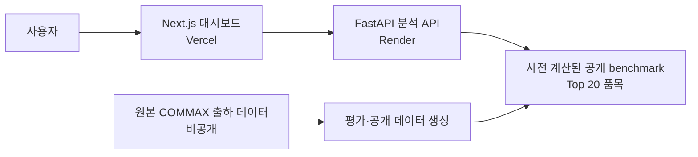

# Demand Signal

> **패턴별 검증으로 리테일 수요 예측 모델을 선택하고, 결과를 의사결정 가능한 화면으로 연결한 데이터 분석 포트폴리오**

[](https://github.com/Samuel-0930/AI-Driven-Retail-Demand-Forecasting-Platform/actions/workflows/ci-cd.yml)
[](https://demand-signal-sepia.vercel.app)
[](LICENSE)

[데모 열기](https://demand-signal-sepia.vercel.app) · [포트폴리오 문서](https://app.notion.com/p/3996f7e3d8288116b879fb891a6f8be0) · [분석 사례 요약](COMMAX_EDA_CASE_STUDY.md)


## 왜 만들었나

간헐적이거나 변동이 큰 수요는 하나의 복잡한 모델을 모든 품목에 적용한다고 잘 풀리지 않습니다. 이 프로젝트는 “가장 복잡한 모델은 무엇인가?” 대신 **“각 수요 패턴에서 실제로 더 정확한 모델은 무엇인가?”**를 시간 순서를 지킨 검증으로 답합니다.

실제 월별 출하 데이터를 baseline부터 Prophet까지 동일한 rolling-origin 검증에서 비교했습니다. 수요 패턴은 전체 이력에 붙어 있는 정적 라벨을 사용하지 않고, **각 검증 회차의 학습 데이터만으로** ADI·CV² 기준으로 다시 계산합니다. 품목 선택 화면에서는 점수만 보여주지 않고 **실제 출하량 vs 당시 예측, 오차, 예측 구간**을 함께 보여 줍니다.

| 데이터 범위 | 검증 설계 | 평가 대상 | 공개 산출물 |
| --- | --- | --- | --- |
| 20,096개 월별 관측치 · 157개 품목 | 3회 rolling origin · 회차별 6개월 | 첫 holdout 이전 누적 출하량 상위 20개 품목 | schema-versioned benchmark · holdout 비교 · 예측 구간 |

## 핵심 결과

패턴별로 WAPE가 가장 낮은 모델을 champion으로 선택했습니다. WAPE는 실제 수요 대비 누적 오차의 비율이므로 **낮을수록 좋습니다.**

| 수요 패턴 | 품목 수 | Champion 모델 | WAPE |
| --- | ---: | --- | ---: |
| Erratic · 변동형 | 6 | Seasonal Croston/SBA | 71.06% |
| Intermittent · 간헐형 | 9 | Croston/SBA | 39.01% |
| Smooth · 안정형 | 5 | Croston/SBA | 35.32% |
| 전체 비교 | 20 | Croston/SBA | **42.53%** |

- Croston/SBA는 전체 비교에서 seasonal naive보다 **15.82%p 낮은 WAPE**를 기록했습니다.
- Prophet은 월초(`MS`) 주기의 미래 시점으로 평가했으며 전체 WAPE는 73.85%였습니다. 이 데이터와 검증 설계에서 champion으로 선택되지 않았습니다.
- 대시보드는 WAPE뿐 아니라 MASE·MAE, 월별 절대오차와 예측 구간 coverage도 제공합니다. MASE는 SKU·fold별로 계산한 뒤 유효한 값의 평균으로 집계합니다.
- 전체 champion(Croston/SBA)의 80%·90% split conformal 구간은 각각 **91.94%·97.78%**의 holdout 적중률을 기록했습니다(각 forecast origin의 직전 3개 origin, 18개 절대오차만 사용).

### 주문 의사결정 backtest

정확도 지표가 실제 주문 행동으로 어떤 차이를 만드는지 보기 위해, 전체 champion(Croston/SBA)을 고정하고 동일한 360개 holdout 월에서 `point forecast` 주문량과 `80% split-conformal` 안전재고 주문량을 비교했습니다. 부족 단위 1개 비용을 잉여 단위 1개 비용의 5배로 둔 **가정 기반** 시뮬레이션입니다.

| 주문 정책 | 부족 수량 | 충족률 | 잉여 수량 | 가정 비용 |
| --- | ---: | ---: | ---: | ---: |
| Point forecast | 97,168 | 78.37% | 93,835 | 579,674 |
| 80% conformal 안전재고 | 10,719 | 97.61% | 439,075 | **492,670** |

80% 정책은 부족 수량을 크게 낮추는 대신 잉여 재고를 늘립니다. 이 비용 비율에서는 가정 비용이 15.0% 낮았지만, 실제 발주 비용·보관비·폐기율·리드 타임·초기 재고가 없으므로 절감액이나 운영 성과로 해석하지 않습니다.

## 데모에서 확인할 수 있는 것

1. **수요 패턴별 모델 선택** — 5개 후보 모델을 같은 시계열 검증으로 비교한 근거
2. **실제 출하량 vs 당시 예측** — 선택 품목의 최근 6개월 holdout과 월별 오차
3. **예측 불확실성** — 예측 구간, coverage, 수요 변동 위험도
4. **가정 기반 재고 계획** — 현재고·입고 예정·리드 타임·서비스 수준을 입력해 계획 수요와 권장 발주량을 계산
5. **주문 정책 검증** — point forecast와 split-conformal 안전재고 정책의 부족·잉여·가정 비용 trade-off 비교

<details>
<summary>재고 계획 시뮬레이터의 계산 방식</summary>

| 산출물 | 계산 방식 |
| --- | --- |
| 리드 타임 수요 | 선택된 champion 모델의 리드 타임 기간 forecast 합계 |
| 안전재고 | 품목별 직전 3개 forecast origin의 절대오차에서 목표 서비스 수준 split-conformal 분위수 선택 |
| 계획 수요 | 리드 타임 수요 + 안전재고 |
| 권장 발주량 | `max(0, 계획 수요 - (현재고 + 입고 예정))` |
| 재고 위험도 | 가용 재고가 forecast·계획 수요를 충족하는지에 따라 낮음/보통/높음 |

</details>

## 분석 흐름


| 단계 | 구현 |
| --- | --- |
| 분류 | 각 fold의 학습 이력에서 ADI·CV²를 계산해 Smooth·Erratic·Intermittent·Lumpy를 분류 |
| 후보 모델 | Seasonal naive, Croston/SBA, Seasonal Croston/SBA, TSB, Prophet |
| 검증 | 미래 6개월을 순차적으로 숨기는 3회 rolling-origin 평가 |
| 평가 | WAPE, MAE, SKU·fold별 MASE, split-conformal 80%·90% coverage·평균 구간 폭, 주문 정책의 부족·잉여·가정 비용 |
| 제품화 | FastAPI 분석 API, Next.js 대시보드, Vercel·Render 배포 |

## 시스템 구성



| 구성 | 역할 |
| --- | --- |
| [Vercel 대시보드](https://demand-signal-sepia.vercel.app) | 사용자 인터페이스와 API 프록시 |
| [Render API](https://demand-signal-api.onrender.com/health) | benchmark·품목별 holdout·계획 시뮬레이션 API |
| `data/public/` | 원본 CSV 없이도 데모를 실행하기 위한 최소 공개 데이터셋 |
| Docker Compose + MLflow | 합성 수요 데이터에서 재현하는 엔지니어링 트랙 |

## 빠른 실행

필수 조건: Python 3.11, Node.js 20+, [`uv`](https://docs.astral.sh/uv/)

```bash
git clone https://github.com/Samuel-0930/AI-Driven-Retail-Demand-Forecasting-Platform.git
cd AI-Driven-Retail-Demand-Forecasting-Platform

uv venv venv --python 3.11
uv pip install --python venv/bin/python -r backend/requirements.txt

cd frontend && npm ci && cd ..
```

터미널 두 개에서 실행합니다.

```bash
# terminal 1 — API: http://127.0.0.1:8000/docs
PYTHONPATH=. venv/bin/uvicorn backend.main:app --reload
```

```bash
# terminal 2 — dashboard: http://127.0.0.1:3000
cd frontend && npm run dev
```

### 실제 데이터로 공개용 benchmark 다시 만들기

원본 COMMAX CSV는 저장소에 포함하지 않습니다. 접근 권한이 있는 경우 아래 경로에 두고 실행합니다.

```text
data/raw/Final_KR_modeling_long_with_external_data.csv
```

```bash
PYTHONPATH=. venv/bin/python backend/evaluate_commax.py
PYTHONPATH=. venv/bin/python backend/prepare_public_demo_data.py
```

### 원본 데이터 없이 예측 API까지 빠르게 확인하기

COMMAX 원본 데이터 없이도, 결정론적 합성 데이터로 학습·검증·예측 API를 재현할 수 있습니다. 아래 명령은 기본 품목(`store_id=1`, `product_id=1`) 모델과 3회 rolling evaluation을 만들고, 마지막 명령은 7일 예측과 evaluation artifact를 함께 확인합니다.

```bash
PYTHONPATH=. venv/bin/python backend/bootstrap_demo.py
PYTHONPATH=. venv/bin/python backend/verify_demo.py
```

그 뒤 API를 실행하면 됩니다.

```bash
PYTHONPATH=. venv/bin/uvicorn backend.main:app --reload
```

## 데이터 계보와 해석 한계

이 저장소는 실제 출하 데이터 분석과 합성 데이터 기반 엔지니어링 데모를 의도적으로 분리합니다. 두 결과를 하나의 end-to-end 운영 모델 성과처럼 해석하지 않습니다.

| 트랙 | 목적 | 데이터 | 성능 해석 |
| --- | --- | --- | --- |
| COMMAX 분석 | 패턴별 benchmark와 모델 선택 | 실제 월별 출하 데이터 | 이 README의 WAPE 결과가 속하는 트랙 |
| 합성 앱 데모 | 학습·실험·API·UI 파이프라인 재현 | 결정론적 합성 리테일 수요 | 실제 출하 데이터 성능을 의미하지 않음 |

- 평가는 상위 20개 품목에 한정되며, 전체 157개 품목의 운영 성능으로 일반화할 수 없습니다.
- 패턴별 WAPE는 품목군 수준의 결과입니다. 개별 품목의 성능은 대시보드 holdout 화면에서 확인해야 합니다.
- `data/public/commax_evaluation.json`에는 schema version, 원본·공개 데이터 fingerprint, code revision, item/champion manifest, SKU×fold×model metric이 기록됩니다. 원본 CSV 자체는 포함하지 않습니다.
- 실제 재고·입고 예정·공급 리드 타임 데이터가 없으므로 재고 계획과 주문 정책 backtest는 **입력값·비용 비율 가정 기반 시뮬레이터**입니다. 실제 재고 운영 성과나 품절 확률, 비용 절감액을 주장하지 않습니다.
- 예측 구간은 각 target origin보다 앞선 3개 origin의 절대오차를 사용한 split conformal 보정값입니다. 표본이 origin당 18개로 작고 수요 시계열은 비정상적일 수 있으므로, 실제 운영 전에는 기간·품목을 늘려 coverage와 과소·과대 예측 비용을 함께 검증해야 합니다.

## 기술 스택

**Analysis & ML**: Python, Pandas, Prophet, Croston/SBA, TSB

**API & UI**: FastAPI, Next.js, TypeScript, Tailwind CSS, Recharts

**MLOps & Infra**: MLflow, Docker Compose, Prometheus, Grafana, GitHub Actions, Vercel, Render

## 문서

- [분석 사례 요약](COMMAX_EDA_CASE_STUDY.md)
- [Data Card](DATA_CARD.md)
- [Model Card](MODEL_CARD.md)
- [개발 가이드](DEVELOPMENT.md)
- [배포 가이드](DEPLOYMENT.md)
- [개선 로드맵](PORTFOLIO_ROADMAP.md)
- [MIT License](LICENSE)
